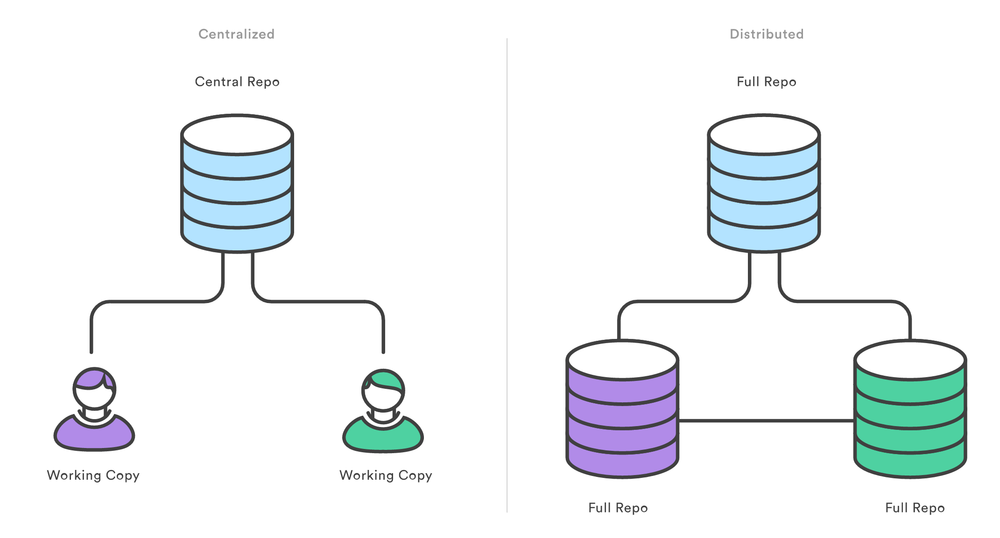

# 先來架環境

--

## 註冊Github

--

## 註冊Cloud 9

---

# Git 小教學

---

## 為什麼要版本管理？
- 歷史編輯紀錄
    - backup
    - traceability
- 多人多工
    - 避免conflict

--

[點我](http://denny.one/SITCON-Workshop-2015-Apr-git/#9)

--

## 有哪些版本管理工具？
- Distributed
    - git
    - mercurial
- Centralized
    - svn

--

--

## Distributed?

--
### 不同distribution可能不一樣

--

## Git? GitHub??
- a free and open source distributed version control system
- a web-based Git repository hosting service

--

---

# hands on!

--

## 安裝 Git
already in your c9.io workspace

--

## some settings
- $ git config --global user.name "Jimmy God"
- $ git config --global user.email "jimmyBadBad@biteme.com"

--

## Start a Project
- 在Github上建一個新repo
- $ git clone git@github.com:whus6207/se101_folks.git

--

## 來幹點活吧
- $ vim gods.txt
- $ vim peasants.txt

--

## 檢查狀況
- $ git status

--

--

## 提交變更
- $ git add .
- $ git commit -m "gods and peasants should separate."

--

--

## 把變更“推”到remote repo
- $ git push

--

## 把別人的變更“拉”下來local
- $ git pull

---

# challenge

--

## 登記Github帳號
[goo.gl/b3u8t5](goo.gl/b3u8t5)

--

## 把自己的名字加進gods.txt
[https://github.com/whus6207/se101_challenge](https://github.com/whus6207/se101_challenge)
